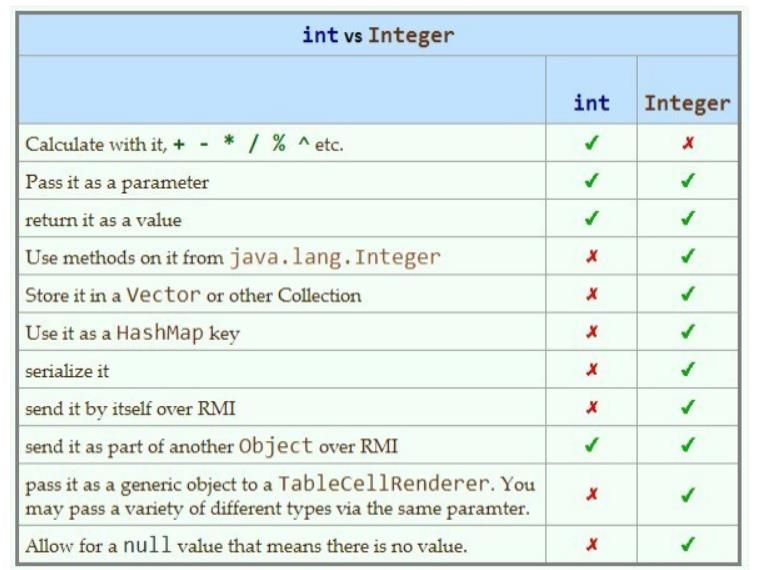

 

# Java - Appunti  - *[Prof. Fabrizio Sacco](http://fabriziosacco.it)*

## Corso (*accelerato!*) di linguaggio JAVA, per programmatori C++  

#### F. Sacco 2022  


|  |  |
| ----------------- | ------------------------------- |


# Prerequisiti: conoscenza di C e di C++)


## Link utili: 

#### 1) [Javapoint](https://www.javatpoint.com/java-tutorial) / [W3schools](https://www.w3schools.com/java/) (Tutorial)

#### 2) [Tohtml](https://tohtml.com/) (Sintassi evidenziata)

#### 3)[Codeboard](https://codeboard.io/users/dsacco)/ [Replit](https://replit.com/@FabrizioSacco) / [Onlinegdb](https://www.onlinegdb.com/online_java_compiler) / [tutorialspoint](http://www.tutorialspoint.com/codingground.htm) (Compiler on line)

#### 4) Indentazione stile [C](https://www.tutorialspoint.com/online_c_formatter.htm) / [Java](https://www.tutorialspoint.com/online_java_formatter.htm)


# ***James Gosling*** (1955) 

### E' un informatico canadese, inventore del linguaggio di programmazione Java


> *Risposta di* ***Bjarne Stroustrup*** (Inventore del C++): “**Much of the relative simplicity of Java is - like for most new languages - partly an illusion and partly a function of its incompleteness**”.
>
> *(traduzione: Gran parte della relativa semplicità di Java è - come per la maggior parte nuovi linguaggi - in parte un'illusione e in parte in funzione della sua incompletezza)* 
>
> *PS: Chi ha ragione? Al lettore la risposta... ;)*

| Linguaggi più richiesti (fonte: irishtechnews.ie) |  |
| ------------------------------------------------- | ---------------- |


# JAVA: Un po' di storia....


**Il 23 Maggio 1995**, **John Gage**, l’allora direttore dello “Science Office” di *Sun Microsystems* insieme a **Marc Andreessen**, cofondatore e vicepresidente di **Netscape Corporation**, annunciarono che “*Java wasn’t a myth*” e che a breve Netscape Navigator avrebbe integrato questa nuova tecnologia nel suo web browser. **Era nata una nuova pietra miliare della storia dell’informatica**: **Java**.

Immaginate 13 tra i maggiori esperti di informatica degli anni ’80 raccolti in un ufficio in Californa ... a sviluppare il linguaggio di programmazione del futuro.

Eppure era successo che tra gli anni ’70 e la fine degli anni ’80 l’hardware aveva subito una delle sue più grandi rivoluzioni: prezzi caduti a picco e performance aumentate straordinariamente. **In quegli anni il C (Dennis Ritchie,1972) era nel pieno della sua diffusione** ma la sua struttura procedurale ed il suo approccio “low level” (puntatori, allocazione della memoria, etc.) lo rendevano impegnativo e di difficile adozione per progetti di sviluppo sempre più complessi e con team di sviluppatori sempre più grandi.

> **Il piano era dunque quello di realizzare un linguaggio che, come il C++, potesse trarre vantaggio dal nuovo paradigma di programmazione ad oggetti ma che non fosse low-level (il C++ era pur sempre una evoluzione del C) e si occupasse automaticamente della gran parte dei dettagli di gestione della memoria e potesse essere facilmente ‘portato' su processori e dispositivi diversi.** 

Dopo 2 anni di lavoro nacque prima un linguaggio chiamato ***Oak*** *che aveva sintassi simile al C e includeva la programmazione ad oggetti... ma non ebbe molto successo.* 

> Poi nel giro di pochi mesi partendo dalla tecnologia dell'OAK ed adattandola ad internet, **naque il primo embrione di Java**: **riuscirono a sviluppare un web browser interamente in Java (Sun’s *HotJava*, 1994)** con il quale poterono mostrare l’idea che avrebbe legato **il nuovo linguaggio alla evoluzione di Internet:** le **applet**, **piccole applicazioni che attraverso un browser potevano essere distribuite ed eseguite come mai prima**. Intessendo infine rapporti con Netscape Corporation ed arrivando ad avere il supporto per le applet nel Navigator **nel 1995 Sun garantì una rapida diffusione a Java**. 

# Java e la OOP resa “facile”


**Java nasce quindi** sostanzialmente per creare un linguaggio **Object Oriented** che risolvesse principalmente due **problemi** concreti:

1. **garantire maggiore semplicità rispetto al C++**, per la scrittura e la gestione del codice;  
2. permettere la realizzazione di **programmi non legati ad una architettura precisa**.  

Il primo degli obbiettivi fu affrontato liberando il programmatore dall’onere della gestione della memoria (*e togliendo dalle sue mani la gestione dei puntatori*) creando il primo linguaggio destinato alla grande diffusione basato su un sistema di gestione della memoria chiamato **garbage collection** in cui *automaticamente la memoria viene assegnata e rilasciata a seconda delle esigenze del programma.*

Il secondo punto fu invece affrontato applicando il concetto di **Macchina Virtuale** (**JVM**) e facendo sostanzialmente in modo che i programmi non fossero compilati in codice macchina (nativo) ma in una sorta di codice “intermedio” (chiamato **bytecode**) che non è destinato ad essere eseguito direttamente dall’hardware ma che deve essere, a sua volta, interpretato da un secondo programma, la macchina virtuale appunto.

Questo significa che lo stesso codice può essere eseguito su più piattaforme semplicemente trasferendo il bytecode (non il sorgente) purché sia disponibile una JVM.

## Java, C, C++

**Java eredita dal C buona parte della sua sintassi** (scelta fatta per facilitarne l’adozione da parte degli sviluppatori C e C++) mentre dal **C++ eredita l’approccio object-oriented** e basato sulle classi.

Approfondimento consigliato: https://it.wikipedia.org/wiki/Java_(linguaggio_di_programmazione)

# Le varie versioni di Java


### La prima versione di Java

La prima implementazione pubblica è del **1995** (Java 1.0). Era già un linguaggio abbastanza sicuro per gli standard dell’epoca: la maggior parte dei web browser seguirono Netscape Navigator e la incorporarono per permettere l’utilizzo delle “applet”.

### Java 2 (o 1.2)

La versione **Java 1.2** fu rilasciato nel **1998**. Fu considerata l’inizio per un nuovo Java, da cui il nome Java2 che ha accompagnato fino ai giorni nostri ogni nuova release di Java: la versione Java 1.3 è chiamata anche Java3 etc.

### Java 3 (1.3)

Nel Maggio del **2000** è stata rilasciata la terza release: **Java 3**

### Java 4 (1.4)

Del 2002 è la **Java 1.4**, che ha aumentato le caratteristiche del linguaggio e le API disponibili

### Java 5 (1.5) 

**Del 2004**

### Java 6 (1.6)

Nel Dicembre **2006** è stata rilasciata la **1.6** (**diffusissima**), che aggiunge ad esempio:

- Web services;  

- Desktop APIs e Desktop deployment;  

- Security: Java SE 6 semplifica la gestione della sicurezza, aggiunge servizi crittografici per l’autenticazione e comunicazone sicura su MSWindows, Java Generics Security Services (Java GSS), servizi Kerberos per l’autenticazione, accesso a server LDAP per l’autenticazione degli utenti.  

### Java 7 (1.7)

La versione la 1.7, rilasciata nel Luglio **2011** aggiunge al linguaggio il supporto della JVM per i linguaggi dinamici, nuova libreria file I/O e nuove APIs per la grafica.

### Java 8 (1.8)

**La versione 1.8 di Java è quella più usata** e presenta, accanto ad ottimizzazioni sulla JVM, crittografia, un nuovo Interprete JavaScript e anche la prima incarnazione del Project Lambda ossia Lamba Expressions native in Java (una prima tranche di programmazione funzionale). -

Dal **2017** E’ arrivato **Java 9,  poi Java 10 e, a fine 2018, Java 11; a oggi (Gen 2022) l'ultima è la Java SE 17.01**


# Java: strumenti

| Strumenti per Java |  |
| ------------------ | ------------------------------------------ |

| Strumento                                  | Descrizione                                                  |
| ------------------------------------------ | ------------------------------------------------------------ |
| **javac**                                  | È il **compilatore**, il cui compito è quello di trasformare il codice sorgente Java nel bytecode che sarà poi eseguito dalla macchine virtuale java (JVM) |
| **JRE (Java Runtime 		Environment)** | L’ambiente di runtime. Serve per far funzionare un applicativo java; contiene la JVM (comando **java.exe** in windows) |
| **JDK**                                    | Oltre **javac** contiene molti tool per lo sviluppo, di seguito introduciamo solamente i più comunemente usati e ci riserviamo di parlare degli altri via via che serviranno |
| **jar**                                    | Java Archiver serve a realizzare archivi di classi.          |
| **javadoc**                                | Utility che serve per generare la documentazione (in HTML) di codice java a partire da commenti inseriti nei sorgenti stessi. La documentazione generata da javadoc è quella che quasi ogni progetto Java mette a disposizione. |
| **javap**                                  | Java Class File Disassembler, una tool per invertire il processo di compilazione, cioè uno strumento che dato un file che contiene la versione compilata (il bytecode) di una classe java recupera i nomi ed i tipi dei field ed i metodi della stessa. |
| **javah**                                  | Tool utilizzata per permettere l’utilizzo di codice scritto in C (detto nativo) da java. |
| **appletviewer**                           | Viewer per applet che consente di eseguirle senza l’ausilio di uno web browser. |
| **jdb**                                    | Java debugger.                                               |


# Installazioni di Java

|                           | NB: 1 billion = 1  Miliardo... |
| ------------------------- | ------------------------------ |
| **Installazioni di Java** |                |

## Configurazioni OS

**Oracle**, che dal 2010 (anno in cui ha acquistato Sun) è proprietaria del marchio Java, supporta il Java Development Kit su molteplici architetture e sistemi operativi: tutte le versioni di Windows, Mac OS X, Linux Oracle, RedHat, Suse, Ubuntu oltre a Solaris e Ubuntu su processori ARM. Se utilizzate uno di questi sistemi operativi vi basterà aprire con il vostro browser preferito l’URL:

```java
// [http://www.oracle.com/technetwork/java/javase/downloads/index.html]
```

e premere il pulsante “DOWNLOAD” per scaricare la release corrente DI JDK ( Java Platform ).

### Impostare le variabili d’ambiente (Windows / Linux)

Il compilatore (`javac`) per default non è nella path e quindi per ‘provarlo’ dovrete andare a cercarlo nella directory di installazione, ad esempio:

​				`C:\Program Files\Java\jdk1.8.0\bin\` 			  			 		

Per  poterlo utilizzare senza doverci preoccupare di includere tutto il percorso possiamo includerlo nelle variabili di ambiente del sistema (PATH). Vediamo come fare nei casi più comuni.

### Impostare PATH su Windows

Per le ultime versioni di Windows i passaggi sono piuttosto simili. Si parte dal pannello di controllo (quello desktop nel caso di Windows 8) e poi cerchiamo l’icona *Sistema*. Nella maschera che appare clicchiamo su *Impostazioni di sistema avanzate* (sulla sinistra). Infine nella nuova maschera troviamo il pulsante *“Variabili d’ambiente”*. Che ci permetterà di accedere al pannello di modifica delle variabili di sistema. 


Qui non rimane che cercare la variabile *Path* e aggiungere il percorso relativo alla nostra installazione (copiamolo tutto fino a `[...]bin\`). Oppure possiamo creare un batch file   (file .bat) che contiene le due linee:

```bash
SET PATH=%PATH%;UNITA:\percorsodiJDK\bin;UNITA:\percorsodiJRE\bin
(esempio di percorso di jdk: “c:\Program Files\Java\Jdk1.8.0\bin”;) → Usa gli apici “ “
```

per uscire a prompt/shell di comandi con il PATH impostato correttamente, prova a lanciare javac (compiler)

*(APPROFONDIMENTO)*

### Impostare PATH su Linux

Su Ubuntu il procedimento è ancora più semplice (e vale anche per altre distribuzioni che utilizzano bash o derivati). È sufficiente modificare il file `.bashrc` e aggiungere la riga:

```bash
export PATH=$PATH:/percorso di Java   
ad esempio: export PATH=$PATH:/opt/jdk1.8.0/bin` 		
```

### Verificare l’installazione

Per verificare che l’istallazione abbia avuto successo potete provare ad eseguire la macchina virtuale, ad esempio aprendo l’interprete dei comandi (o il terminale) e provando a lanciare il comando:

​				`java -version` 		

**Utile, su windows, il seguente BATCH file (tes: ExJava.bat) → permette, se trasciniamo il .class sull'icona del file batch, di lanciare il programma. Provalo!**

```bash
@echo off 
REM qui sotto il CD porta nella cartella dove il file .class risiede:
CD %~d1%~p1
REM qui sotto lancio la JAVA VM con il nome del programma .class senza estensione:
START java %~n1
```

# OpenJDK alternativa a Oracle? 


> La più grande differenza tra OpenJDK e Oracle JDK è la licenza. **OpenJDK** è Java completamente open source con una GNU General Public License. **Oracle JDK** richiede una licenza commerciale ai sensi del Contratto di licenza Oracle Binary Code. Ma ci sono anche molte altre differenze in termini di supporto e costi. 

**Da gennaio 2019**, [le aziende ora devono acquistare una licenza commerciale](https://translate.google.com/website?sl=en&tl=it&hl=it&client=webapp&u=https://www.infoworld.com/article/3269332/java/oracle-sets-date-for-end-of-java-8-updates.html) (da Oracle) per ricevere gli aggiornamenti software. Ulteriori dettagli sono disponibili nella pagina [Roadmap del supporto Oracle Java SE](https://translate.google.com/website?sl=en&tl=it&hl=it&client=webapp&u=https://www.oracle.com/technetwork/java/java-se-support-roadmap.html) 

## Quindi, OpenJDK *è* uguale a Oracle JDK?

OpenJDK ha lo stesso codice di OracleJDK, a seconda del provider che stai utilizzando. La differenza fondamentale (come indicato sopra) è che OpenJDK è un kit di sviluppo java open source, mentre Oracle JDK è closed source. 

## Che dire di OpenJDK e prestazioni di Oracle JDK?

> Le prestazioni di Oracle JDK erano migliori di OpenJDK, ma le cose stanno cambiando. Le prestazioni di OpenJDK sono in continuo miglioramento. Le build OpenJDK stanno diventando più stabili con i contributi della comunità OpenJDK. Quindi oggi le prestazioni di OpenJDK sono di prim'ordine.

## Posso usare OpenJDK **per ogni cosa**?

Puoi usare OpenJDK per progetti software commerciali. OpenJDK può essere un buon sostituto di Oracle JDK in questo senso.

# Installazione notepad++  per JAVA 

#### (o per altri linguaggi, come PHP)


1. 1) **Scarica notepad++** (meglio versione .zip solamente da decomprimere) **dal sito**   

   ​    https://notepad-plus-plus.org/download/

3. 2) **Dezippa notepad**++

4. 3) **Apri il Plugin menù** come qui sotto:

 

4) Cerca il plugin NPPEXEC ed installalo. (Oppure copia la dll nella cartella delle dll e riavvia notepad++)
5) Ora riavvia notepad++ e apri il plugin menù: ora puoi trovare NPPEXEC; imposta i seguenti:
   disabilita “console command history”
   abilita “save file on execute”
   abilita “Follow $(CURRENT_DIRECTORY)” 
   (vedi sotto)


6) Ora apri la finestra “execute” con il tasto F6 e digita (completa con il percorso i puntini) le due linee:

    cd $(CURRENT_DIRECTORY)
    C:\Program.....\javac $(FILE_NAME)

7) Salva poi come “Compila JAVA”. Ripeti poi con le due linee:

    cd $(CURRENT_DIRECTORY)
    C:\Program.....\java $(NAME_PART)

​         e salva come “Lancia JAVA”.  

8) Ora prosegui per aggiungere trovi la compilazione ed il run nel menù Macro! 

NB: Puoi anche creare shortcuts (Es. ALT+J per compilare e ALT+R per il Run)

9) *Continua Installazione Java in Notepad++*   Segui la configurazione (***che ho lasciato volutamente in inglese***) dei bottoni “COMPILA JAVA e LANCIA JAVA: 

10. If you want to create the shortcuts for compiling and running the code. 

    Then continuing reading the post. Open once again the Plugin menu → And click on NppExce->Advanced Options 

    Check the option “Place to macro submenu’ 


And below in the Associated script.. select any one script 

Run or compile at first time and click on Add/Modify button And click on OK button. (Do this step for both the scripts ):


So that a new menus are created under macros menu: now to create short cut keys open the settings menu. Click on Shortcut Mapper. Find your scripts name and assign your own shortcut keys. (I prefer alt+r for run and alt+j for compile ) -> Risultato finale nella figura qui sotto:


Per ultimo crea un batch di lancio  che configura il PATH (vedi sopra) e poi lancia notepad++.exe


# Java: compilato ed interpretato


#### 1) Java è sia compilato che interpretato

#### 2) I file che contengono il codice sorgente Java (.java) vengono compilati con javac 

#### 3) Il file generato dal compilatore ha lo stesso nome del file sorgente ed estensione .class 

#### 4) Il file compilato non contiene codice oggetto eseguibile di un determinato microprocessore ma un "bytecode"

#### 5) Il bytecode non è specifico per alcun processore perchè Java è un linguaggio multipiattaforma: può essere eseguito, senza ricompilazione, su diverse combinazioni di processori e sistemi operativi

#### 6) Per eseguire il bytecode è necessario un interprete (la Java Virtual Machine), che traduca il codice oggetto multipiattaforma (bytecode) in istruzioni del processore in uso 


# Primo programma JAVA

#### (e compilazione a mano....)


È comunque molto utile e istruttivo imparare a organizzare tutto “a mano”, passo dopo passo, anche commettendo volutamente i tipici errori in cui si può incorrere la prima volta.

Il primo programma che scriveremo è breve ma già permette di osservare molte cose:

```java
public class CiaoMondo //online: [https://codeboard.io/projects/310279] 
{ 
   public static void main(String[] argomenti)  
   { 
      System.out.println("Ciao mondo");
   }
}
/**  Java program's main method has to be declared static because keyword static allows main to be called without creating an object of the class in which the main method is defined. If we omit static keyword before main Java program will successfully compile but it won't execute. **/
```

Iniziamo copiando il codice in un file in un qualsiasi editor di testi (blocco note per ora va bene, ma anche notepad++). Salviamo e chiamiamo l’esempio **CiaoMondo.java**, poi lanciamo il compilatore:

```bash
javac CiaoMondo.java
```

Otteniamo il file di bytecode `CiaoMondo.class`. Lo lanciamo con:

```java
 Java CiaoMondo
```

```
Qui il nome “CiaoMondo” che passiamo come argomento dell’eseguibile java non si riferisce al nome del file .class, ma è proprio il nome della classe da eseguire.
```

# I nomi delle classi in Java, convenzioni


In Java ogni classe (`public class`) deve essere contenuta in un file il cui nome sia identico al nome della classe stessa:

 ad esempio `Classe` dovrà stare nel file `Classe.java` e `Primo` dovrà quindi stare nel file `Primo.java`.

In Java le classi possono avere i nomi più disparati: `primo`, `PRIMO`, `PrImo123`, `primo, `_primo sarebbero stati tutti nomi validi, ma esiste una convenzione che prevede che **i nomi delle classi** **inizino con un carattere maiuscolo**, continuino con caratteri minuscoli e, se composti da più parole, siano capitalizzate le prime lettere di tutte le componenti.

Quindi se volessimo creare una classe che si chiami “prima classe del tutorial” la convenzione ci indicherebbe di chiamarla `PrimaClasseDelTutorial`.


# Secondo programma: 

**argomenti in ingresso, commenti**

```java
public class ArgomentiMain //online: [https://codeboard.io/projects/310281] 
{
    public static void main(String[] argomenti)
    {
        int i;
        for (i = 0; i< argomenti.length; i++) 
            System.out.println("argomenti[" + i + "]: " + argomenti[i]);
       
    }
}
// differenze da C/C++: il primo argomento NON e' il nome del programma
// per trovare il nome del programma, decommenta il seguente e salva in file 
// NomeProgramma.java
// Si osservi anche la proprieta' "length" per i vettori, che ne ritorna la lunghezza
public class NomeProgramma
{
	public static void main(String[] argomenti) 
	{
		System.out.println(NomeProgramma.class.getName());
	}
}
/** Approfondimenti/Esercizi
1) Esercizio: provare il corrispondente in Java del seguente C++ **/

#include <iostream> //online: [https://codeboard.io/projects/310290] 
using namespace std;
int main(int argc, char *argv[], char *env[]) {
	for (int i=0; i<argc; i++)
		cout<<"argv["<<i<<"]="<<argv[i]<<" "<<endl;
	for(int i=0; env[i]; i++)
	    cout<<"env["<<i<<"]="<<env[i]<<" "<<endl;
	return 0;
}
/** NB: argv[] e' un vettore di numero argc stringhe, env[] e' un vettore
di variabili d'ambiente (stringhe) che termina con NULL....***/

2) Nota: Che barba … scrivere  System.out.print......: si puo' accorciare? 
A) usare direttamente l'oggetto PrintStream, senza passare per la sua classe contenitrice System:
public static void main(String[] args) {
PrintStream out = System.out;
// D'ora in poi puoi usare direttamente "out.println"
out.println("Ciao");
}
B)  usare lo static-import: 
import static java.lang.System.*;
...
public static void main(String[] args) {   out.println(" ... ");   }
```

# Tipi di dati base in Java:


## Confronto con il C/C++ per architettura a 32 bit:

| Tipo                 | Byte   | Range                           |
| -------------------- | ------ | ------------------------------- |
| *char*               | 1byte  | -127 to 127 or 0 to 255         |
| *unsigned char*      | 1byte  | 0 to 255                        |
| *signed char*        | 1byte  | -127 to 127                     |
| *int*                | 4bytes | -2147483648 to 2147483647       |
| *unsigned int*       | 4bytes | 0 to 4294967295                 |
| *signed int*         | 4bytes | -2147483648 to 2147483647       |
| *short int*          | 2bytes | -32768 to 32767                 |
| *unsigned short int* | 2bytes | 0 to 65,535                     |
| *signed short int*   | 2bytes | -32768 to 32767                 |
| *long int*           | 4bytes | -2,147,483,648 to 2,147,483,647 |
| *signed long int*    | 4bytes | same as long int                |
| *unsigned long int*  | 4bytes | 0 to 4,294,967,295              |
| *float*              | 4bytes | +/- 3.4e +/- 38 (~7 digits)     |
| *double*             | 8bytes | +/- 1.7e +/- 308 (~15 digits)   |
| *long double*        | 8bytes | +/- 1.7e +/- 308 (~15 digits)   |

# Funzioni in JAVA

### (in più: input da tastiera/file/numeri pseudocasuali, try-catch)


```java
import java.util.Scanner;  // Input da tastiera, libreria
public class EsempioMinimo{
  //online: [https://codeboard.io/projects/310291]
  public static void main(String[] argomenti) 
  {
          int a,b;
          Scanner in = new Scanner(System.in);
          System.out.println("Primo   numero ->");
      	  a = in.nextInt(); 
          // Per float usa metodo nextFloat(), per stringa usa nextLine()
          System.out.println("Secondo numero ->");
      	  b = in.nextInt();
          System.out.println("Valori immessi a= " + a + ", b= " + b);
      	  int c = minimo(a, b);
      	  System.out.println("Valore minimo = " + c);
  }

  public static int minimo(int n1, int n2) 
  {
      if (n1 > n2) n1=n2;
      return n1;
  }
}
```

# Input da file di testo e ... 


###  ...try-catch

```java
import java.io.File;  // Input da file di testo, try-catch
import java.util.Scanner;
public class LeggiFile {
public static void main(String[] argomenti) {
 //online: [https://codeboard.io/projects/310292]
try {   // Gestisce eccezioni, ad esempio file non trovato
            Scanner in = new Scanner(System.in);
            String str;
            System.out.print("Nome del file di testo da leggere: ");
            str= in.nextLine();
            File f = new File(str);
            Scanner s = new Scanner(f);
            while (s.hasNextLine()) 
                        {
                str = s.nextLine();
                System.out.println(str);
            }
            s.close();
   } catch (Exception ex) { ex.printStackTrace(); }
 } // fine main
}// fine class LeggiFile
```

# Approfondimento 

#### Usare try-catch per codificare in modo semplice funzioni di test

Si immagini, ad esempio, di aver bisogno di una funzione che verifichi se una stringa rappresenta un numero double. Ad esempio se riceve in input "-34.456" deve ritornare vero, se riceve "123.4-1" falso. Invece di scrivere la funzione, potrebbe essere più facile ragionare in "logica inversa": provo a convertire la stringa in double (con parseDouble) e **sfrutto il try-catch per vedere se l'operazione va a buon fine**! 

Ecco il codice:

```Java
public static boolean isNumeric(String strNum) 
{ // per vedere se una stringa e' numerica
    try {
      double d = Double.parseDouble(strNum);
    } catch (NumberFormatException nfe) {
      return false; // se fallisce la conversione, ritorno false
    }
    return true; // se la conversione è ok, ritorno true
  }
// Esercizi:
// Si codifichino funzioni con try-catch che verifichino
// 1)Un file esiste
// 2)Se l'elemento E puo' essere inserito nel vettore V in posizione N
    
```

# Lettura di un file di interi 

#### e visualizzazione della somma

```java
import java.io.File;
import java.util.Scanner;
public class LeggiFileInt {
//online: [https://codeboard.io/projects/310294]
	public static void main(String[] argomenti) {
		try {  // per gestire "file non trovato"
			Scanner in = new Scanner(System.in);
			String str;
			System.out.print("Nome del file di int -> ");
			str= in.nextLine(); // Qui su codeboard i file sono soot Root
			File f = new File(str);
			Scanner s = new Scanner(f);
			double tot=0;
			int i;
			while (s.hasNextLine())  {
				i = s.nextInt(); // Non lasciare linee vuote nel file
				tot+=i;
				System.out.println(i);
			}
			s.close();
			System.out.println("totale: " + tot);
		} catch (Exception ex) {
			ex.printStackTrace();
		}
	}
}
// Esercizio: Aggiungi funzioni media, minimo, massimo, conta valori
```

# Numeri pseudocasuali 

#### compresi fra min e max

```java
import java.util.Random; // Numeri pseudocasuali compresi fra min e max
import java.util.Scanner;  // Input da tastiera, libreria
public class NumeriCasuali { //online: [https://codeboard.io/projects/310298]

	public static void main(String[] argomenti) {
		int min,max,val,i;
		Scanner in = new Scanner(System.in);
		System.out.println("Numero minimo  generato->");
		min = in.nextInt();
		System.out.println("Numero massimo generato->");
		max = in.nextInt();
		System.out.println("Quanti valori fra " + min + " e " + max + " vuoi generare ->");
		val = in.nextInt();
		for (i=0; i < val; i++)
			System.out.println(random(min,max));
	}

	public static int random(int min, int max) {
		Random ra=new Random();
		int r = ra.nextInt((max - min) + 1) + min;
		return r;
	}
}
/// Esercizi:
/// 1 programmi: di lancio di 2 dadi / n dadi / estrazione di 40 carte senza ripetizione
/// 2 programma che visualizzi frequenze di valori pseudocasuali da uno a 10 e frequenze relative
/// (vedi vettori alla pagina successiva...)
    
```


# Vettori

### (lettura input, minimo, ordinamento)


```java
import java.util.Scanner;
import java.util.Arrays;
public class Vettore { //online: [https://codeboard.io/projects/310299]

	public static void main(String[] argomenti) {
		int v[] = new int[10];      /// Allocazione del vettore
		get(v); // carico vettore da tastiera
		System.out.println("minimo="+min(v));
		ordina(v);
// Arrays.sort(v); prova a decommentare, commentando la precedente linea
		System.out.println("Vettore ordinato:");
		put(v);
	}
	public static void get(int v[]) { // legge vettore da tastiera
		Scanner in = new Scanner(System.in);
		for (int i=0; i < v.length; i++) {
			System.out.print("v["+i+"]->");
			v[i] = in.nextInt();
		}
	}
	public static void put(int v[]) { // scrive vettore su video
		for (int i=0; i < v.length; i++)
			System.out.println("v["+i+"] = "+v[i]);
	}
	public static int min(int v[]) { // scrive vettore su video
		int min=v[0];
		for (int i=1; i < v.length; i++)
			if (v[i] < min) min = v[i];
		return min;
	}
	public static void ordina(int v[]) { // scrive vettore su video
		for (int i=0; i < v.length-1; i++)
			for (int j=i+1; j < v.length; j++)
				if (v[i] > v[j])
					scambia(v,i,j);
	}
	public static void scambia(int v[],int x, int y) {
		int dep=v[x];
		v[x]=v[y];
		v[y]=dep;
	}
}
/// Seguono 2 esercizi....
/// 1) Codificare ricerca(), ricercadicotomica(), inverti(), media(),...
/// 2) Provare i seguenti interessanti metodi della classe Arrays:

```

| Metodi                                                       | Azione eseguita                                              |
| ------------------------------------------------------------ | ------------------------------------------------------------ |
| binarySearch()                                               | Cerca l'elemento specificato nell'array con l'aiuto dell'algoritmo di ricerca binaria |
| binarySearch(array, 			fromIndex, toIndex, key, Comparator) | Cerca in un intervallo della array specificata l'oggetto specificato utilizzando l'algoritmo di ricerca binaria |
| compare (array1, array 2)                                    | Confronta due array                                          |
| copyOf(originalArray, newLength)                             | Copia l'array specificato, troncandolo o riempiendolo con il valore predefinito (se necessario) in modo che la copia abbia la lunghezza specificata. |
| copyOfRange(originalArray, fromIndex, endIndex)              | Copia l'intervallo specificato della array specificata in un nuovo array. |
| equal(array1,array2)                                         | Controlla se entrambi gli array sono uguali o meno.          |
| fill(originalArray,fillValue)                                | Assegna un valore di riempimento a ciascun elemento di questo vettore |
| hashCode(originalArray)                                      | Restituisce un hashCode intero di questa istanza di array.   |
| mismatch (array1, array2)                                    | Trova e restituisce l'indice del primo elemento non corrispondente tra i due vettori. |
| sort(array originale)                                        | Ordina l'array completo in ordine crescente.                 |
| sort(originalArray,fromIndex, endIndex)                      | Ordina l'intervallo dell’ array specificato in ordine crescente. |
| toString(originalArray)                                      | Restituisce una rappresentazione di stringa del contenuto di questa array. La rappresentazione della stringa consiste in un elenco degli elementi dell'array, racchiuso tra parentesi quadre ("[]"). Gli elementi adiacenti sono separati dai caratteri una virgola seguita da uno spazio. Gli elementi vengono convertiti in stringhe come dalla funzione String.valueOf(). |


# For-each loop in Java


**For-each è un'altra tecnica di attraversamento dell'array, introdotta in Java 5**. 

- Inizia con la parola chiave **for** come un normale ciclo for.
- Invece di dichiarare e inizializzare una variabile contatore di ciclo, si  dichiara una variabile dello stesso tipo del tipo di base dell'array,  seguita da due punti, seguito dal nome dell'array.
- Nel corpo del ciclo, puoi utilizzare la variabile di ciclo che hai creato  anziché utilizzare un elemento di matrice indicizzato. 

```java
// il "normale" for sul vettore vet[] ...
for (int i=0; i<vet.length; i++) // v= array di int o altro
{ 
    Esamino(vet[i])
}

// ...si trasforma in

for (int elem : vet) 
{ 
   Esamino(elem);     // elem == v[i]
}

// Esercizio 1 : riscrivere l'esercizio precedente Class Vettore
// [https://codeboard.io/projects/310299] trasformando i cicli in for-each 


// Esercizio 2
// In C++, è stato introdotto il foreach dal C++ 11:
// il vostro compilatore, compila il seguente programma?
#include <iostream>
using namespace std;
// [https://codeboard.io/projects/310302]
int main() {
    int vet[] = { 10, 20, 30, 40 }; 
    // Printing elements of an array using
    // foreach loop
    for (int x : vet)
        cout << x << endl;
}

```

# Scrittura di file


#### (in più *split* di stringhe, *vettore dinamico*, *sprintf* alla C, *system()* del C/C++)

```java
import java.util.Scanner;
import java.io.*;
//online: [https://codeboard.io/projects/310303]
public class ScritturaFile { 
	public static void main(String[] argomenti) {
		try {  // per gestire errore
			Scanner in = new Scanner(System.in);
			String str;
			String [] parole;
			// Vettore di parole (stringhe)
			double [] numeri;
			// Vettore di double
			double tot=0.0;
			// Totale valori
			System.out.print("Una serie di numeri (virgola=.) separati da spazio->");
			str= in.nextLine(); // Leggo tutta la linea
			parole = str.split(" ");
			// Parole diventa un vettore di stringhe
			numeri = new double[parole.length];
			// Vettore di double della lunghezza giusta!
			for(int i=0; i < numeri.length; i++)
				numeri[i]= Double.parseDouble(parole[i]);
			/// Converto ogni parola (es. "22.34") in numero double...
		
			FileWriter fd = new FileWriter("numeri.txt"); ///Apro file in scrittura
			str="";
			//uso str come una sola stringa di output
			for(int i=0; i < numeri.length; i++) {
				// Preparo l'output...
				str+=String.format("%14.2f\n", numeri[i]);
				tot+=numeri[i];
			}
			str+="Tot="+String.format("%10.2f\n", tot);
			// Aggiungo il totale
			fd.write(str); // scrivo tutto l'output in un "colpo" solo
			fd.close(); // Chiudo il file
		} catch (Exception ex) {
			// Gestione eccezioni (errori)
			ex.printStackTrace();
		}

// DA qui aggiunto per vedere file creato con comando di sistema operativo
// puoi provare su Linux a mettere "cat numeri.txt"
		
		String command = "cmd /c type numeri.txt"; // Comando Windows
		try {
			Process process = Runtime.getRuntime().exec(command);

			BufferedReader reader = new BufferedReader(
			    new InputStreamReader(process.getInputStream()));
			String line;
			while ((line = reader.readLine()) != null) {
				System.out.println(line);
			}

			reader.close();

		} catch (IOException e) {
			e.printStackTrace();
		}
	}
}

```

# Approfondimento


### **Javadoc**: documentazione automatica

| Javadoc è uno strumento che permette di documentare i sorgenti di un programma all’interno dei sorgenti stessi. Anziché scrivere la documentazione di un programma in un file separato, il programmatore inserisce nel codice sorgente dei commenti in un formato particolare. Tali commenti vengono estratti dal programma |  |
| ------------------------------------------------------------ | -------------------------------------------- |

### Proviamo semplicemente Javadoc dal prompt di comandi:

**Javadoc -d c:\documentazione Vettore.java**  → permette di ottenere, nella cartella destinazione [c:\documentazione](file:///c:/documentazione), la documentazione relativa alla classe (file) Vettore.java (esercizio pagina precedente).

E' anche possibile, con il comando:  **Javadoc -d  .\doc \*.java** → ottienere la documentazione di tutte le classi/file .java nella sottocartella doc.


**Approfondimenti su Javadoc in italiano:** http://wwwusers.di.uniroma1.it/~parisi/Risorse/IntroJavadoc.pdf


# **Javadoc**: Esempio

### Dato l’esercizio della classe [Vettore](#vettori) si provi a definire, per ogni metodo, un commento, come qui sotto, nel metodo **put()**

(la classe Vettore la trovi online: [https://codeboard.io/projects/310299])

```java
/** 
 * Metodo Put per <h2>scrivere</h2> il vettore sullo schermo
 * Nota che per la lunghezza <b>si usa length</b>
 */

   public  void put(int v[]) // scrive vettore su video
   {     
               for (int i=0; i < v.length; i++)
                      System.out.println("v["+i+"] = "+v[i]);
                        
   }
```

**Puoi pure provare ad inserire altri commenti, anche con altro codice HTML (perfino tabelle)...**

Salva il file Vettore.java e...

1) dalla cartella che contiene Vettore.java, esci a prompt dei comandi con il PATH correttamente impostato per lanciare JAVADOC (dovrebbe partire manualmente, ad esempio, Java, Javac,….)

2) lancia, ad esempio, i comandi:

**md javadoc**   → Creo sottocartella javadoc

**javadoc -d javadoc \*.java** → Creo documentazione con javadoc, nella sottocartella javadoc.

E poi cliccare sul file **javadoc/index.html** per vedere la documentazione creata!


# Visualizzazione di cifre decimali 

#### (e altri Scanner) 


Si possono usare **specificatori** di formato e la funzione **printf**, quasi come in C/C++:

```java
import java.util.Scanner; 
public class TestPrintf //online: [https://codeboard.io/projects/310307]
{
  public static  double[] LeggiDouble () 
  /// Alloca un vettore di n double, lo legge da tastiera, lo ritorna 
    {
        int n = 0;
        Scanner in = new Scanner(System.in);    
        System.out.print("Dimensione array: ");
        n = in.nextInt();
        double[] array = new double[n]; /// Alloco vettore di n elementi
        for (int i = 0; i < n; i++)
        {
            System.out.printf("Dammi il double in posizione %3d: ", i);
            array[i] = in.nextDouble(); 
            /// digitare il numero con LA VIRGOLA    
            /// es. 1,3 e non 1.3 !!!
        } 
        return array;
    }
        
  public static  void printTot (double[] vett )
    {
        double tot = 0;
        for (int i = 0; i < vett.length; i++)
        {
            // stringa di formato: "Elemento %3d: %7.2f %n"
            // ci sono 4 specificatori di formato:
            // - %3d stampa come intero decimale con tre cifre
            // - %7.2f virgola mobile con 4 cifre, il punto e due decimali
            // - %n ritorno a capo 
            System.out.printf("Elemento %3d: %7.2f %n",i,vett[i]);
 /// NB: e se rimpiango anche la sprintf() del C:String s = String.format("%4d", n);
            tot = tot + vett[i];
        }
        System.out.printf("==========================%n");
        System.out.printf("      Totale: %7.2f %n",tot);
    }
        
    public static void main(String[] args)
    {    
        double[] vettore = LeggiDouble();  // leggi array di double
        printTot(vettore); /// Stampa dati con printf()
    }
}
/**
SCANNER:
int nextInt() /// legge un numero intero
double nextDouble()  //legge un numero reale
String nextLine() oppure next() ///legge una linea di testo / una parola
**/
```


# Arrotondamenti in Java


**Java** mette a disposizione differenti metodi di **arrotondamento** e **troncamento** per soddisfare un po' tutte le esigenze.

Una possibile soluzione (parziale) è l'utilizzo della libreria ***java.lang.Math***, in particolare dei suoi 4 metodi elencati di seguito:

**FLOOR - double floor(double d):**

questo metodo, come si evince dal nome "*floor*" (*pavimento*) arrotonda il numero alla cifra intera inferiore (il cosiddetto **arrotondamento per difetto** o troncamento).

ESEMPI:

double floor(4.4) -> restituisce 4.

double floor(4.6) -> restituisce 4.


**CEIL - double ceil(double d):**

questo metodo, al contrario di *floor* significa *soffitto* e, come intuibile, arrotonda il numero alla cifra intera superiore (**arrotondamento per eccesso**)

ESEMPI:

double ceil(4.4) -> restituisce 5.

double ceil(4.6) -> restituisce 5.


**ROUND - int round(double) oppure long round(double d):**

questo metodo rappresenta l'arrotondamento più usato, il cosiddetto "**arrotondamento matematico**". In pratica arrotonda il numero all'intero più piccolo se la prima cifra decimale eliminata è minore/uguale a 4 e all'intero più grande se è maggiore/uguale a 5.

ESEMPI:

double round(4.4) -> restituisce 4.

double round(4.5) -> restituisce 5.

double round(4.6) -> restituisce 5.

```java
import java.lang.Math; /// Test Arrotondamenti
public class TestArrotondamenti {
//online: [https://codeboard.io/projects/310309]
   public static void main(String[] args) 
   {
      double n = 12345.34567;
      System.out.println("Numero " + n);
      System.out.println("Arrotondato....");
      System.out.println("PER DIFETTO FLOOR " + Math.floor(n));
      System.out.println("PER ECCESSO CEIL "  + Math.ceil(n));
      System.out.println("ARROTONDATO ROUND " + Math.round(n));
   }
}
```

# Stringhe e metodi sulle stringhe in Java


Il modo più semplice e diretto per creare un oggetto di tipo `String` è assegnare alla variabile un insieme di caratteri racchiusi fra virgolette:

```java
String 			titolo = "Lezione sulle stringhe";
```

questo è possibile in quanto il compilatore crea una variabile di tipo String ogni volta che incontra una sequenza racchiusa fra doppi apici; nell’esempio la stringa

 `"Lezione sulle stringhe"`

 viene trasformata in un oggetto String e assegnato alla variabile `titolo`. Questa forma di inizializzazione è detta **string literal**

Oltre alla modalità “literal”, poiché si tratta comunque di oggetti, le variabili di tipo String possono essere inizializzate anche utilizzando la keyword **new** e un costruttore come si vede nell’esempio seguente:

```Java
public void initString() { 
    // Inizializzazione con una new 
    String titolo = new String("Titolo dell'opera"); 
    // Inizializzazione che fa uso di un array di caratteri 
    char[] Sottotitolo = {'s','o','t','t','o','t','i','t','o','l','o','!'}; 
    String sottotitolo = new String(Sottotitolo); }
```

**Dalla versione 8 di Java, String conta ben 13 costruttori** (oltre a 2 deprecati ed una decina di metodi statici che in qualche modo creano istanze di tipo stringa a partire da altri tipi di variabili).

## Length, la lunghezza di una stringa

La classe String espone anche numerosi metodi per l’accesso alle proprietà della stringa sulla quale stiamo lavorando; uno di questi è il metodo **length()**, che ritorna il numero di caratteri contenuti nell’oggetto. La sua signature è:

```java
int length()
```

Per esempio le seguenti linee di codice:

```java
public void printLength() { 
    String descrizione = "Articolo sulle stringhe ..."; 
    int length = descrizione.length(); 
    System.out.println("Lunghezza: " + length); 
}
```

stampano come risultato:

```
Lunghezza: 			27
```

In questo esempio è interessante notare anche come il compilatore interpreti automaticamente l’espressione `"Lunghezza: " + length`, creando un oggetto di tipo String ottenuto concatenando la stringa che troviamo in prima posizione e la stringa ottenuta dalla rappresentazione decimale del valore di `length` (variabile di tipo `int`).

In sostanza viene svolta per noi una conversione di tipo senza la quale avremmo dovuto scrivere qualcosa di questo genere:

```java
"Lunghezza: "+ String.valueOf(length);
```

Il metodo (statico) **valueOf** di String, restituisce la rappresentazione testuale del parametro di tipo `int` che riceve in ingresso.

# Stringa = (quasi..)  array di caratteri

Possiamo pensare a una stringa esattamente come a un **array di caratteri**, questo significa che possiamo considerare i singoli caratteri come elementi di array. Consideriamo questa stringa:

```java
String 	str = "Ciao HTML.it";
```

Il carattere `'C'` è alla posizione `0`, il carattere `'i'` è alla posizione `1`, … il carattere `'t'` finale è alla posizione che coincide con `str.length()-1`.

Per **accedere ai singoli caratteri** non possiamo usare l’operatore ‘`[]`‘ come negli array, ma possiamo, in modo simile,  usare il metodo **charAt**:

```java
char charAt(int index);
```

## Concatenare le stringhe

L’operazione di concatenazione di stringhe può essere effettuata in modi diversi. La classe String fornisce il metodo **concat** per la concatenazione di stringhe la cui signature è:

```java
String 	concat(String str);
```

Quindi:

```java
String str1 = new String("Nome "); 
String str2 = new String("Cognome "); 
String str3 = str1.concat(str2);
```

assegna a `str3` una nuova stringa formata da `str1` con `str2` aggiunto alla fine;

 insomma `"Nome Cognome"`.

**Avremmo potuto ottenere la stessa cosa utilizzando l’operatore ‘**`**+**`**‘:**

```java
String 	str1 = "Nome";
String str2 = "Cognome";
String str3 = str1+str2;
```

Oppure avremmo potuto costruire la stringa concatenata direttamente tramite literals:

```java
String str3 = "Nome"+"Cognome";
```

## Substring, estrarre una sottostringa

Per prelevare  una porzione di una stringa possiamo utilizzare il metodo **substring**, presente in 2 forme (overloaded):

```java
String 	substring(int beginIndex);
String 	substring(int beginIndex,int endIndex);
```

La prima ritorna una stringa (sottostringa di quella di partenza) a partire dall’indice specificato fino alla fine della stringa; la seconda invece, ritorna una stringa che è anch’essa sottostringa di quella di partenza, ma che parte dall’indice `beginIndex` e termina in `endIndex`. 

Per esempio:

```java
String 	titolo = "I promessi Sposi";
String a = titolo.substring(2);   // a vale "promessi Sposi"
String b = titolo.substring(12);  // b vale "Sposi"
String c = titolo.substring(2,9); // c vale "promessi"
```

**Nota:** *tutti i metodi che operano sulle stringhe sono caratterizzati dal fatto di non modificare la stringa su cui vengono applicate* *ma di ritornarne una nuova.* 

*Ad esempio* `titolo.substring(12)` *non modifica* `titolo` *ma ritorna una nuova variabile di tipo* `String` *che contiene la sottostringa* `"Sposi"`*;*

### Stringhe, oggetti “immutabili”

Anche se cercassimo con attenzione non troveremmo come fare l’operazione di ‘estrazione’ direttamente su una stringa: in Java **le stringhe sono oggetti immutabili**, cioè il loro valore non può essere cambiato dopo la loro creazione (come gli array non possono cambiare lunghezza per fare un parallelo).

L’immutabilità dell’oggetto String deve sempre essere tenuta presente ogni volta le si manipolano, non è infatti difficile cadere in errori come questo:

```java
String 	messaggio = "Ciao XX";
messaggio.replace("XX","Mondo");
System.out.println(messaggio);
```

→ Infatti cosa visualizza a video? Provalo!

Per modificare il contenuto di una stringa di caratteri è consigliabile utilizzare le classi **StringBuffer** o **StringBuilder** che, al contrario di `String`, possono essere modificati senza lasciare oggetti inutilizzati e secondo i casi possono risultare quindi assai piu’ performanti (e comodi). 

## I metodi per manipolare le stringhe

Oltre al `replace`, la classe `String` mette a disposizione molti altri metodi per manipolare le stringhe. 

Alcuni fra i più usati sono:

| Metodo                                       | Descrizione                                                  |
| -------------------------------------------- | ------------------------------------------------------------ |
| `boolean `**contains**`(CharSequences)`      | ritorna true se e solo se la stringa contiene la sequenza di caratteri specificati dal parametro `s` |
| `boolean 		`**equals**`(Object anObj)` | confronta la stringa con l’oggetto obj specificato           |
| `boolean 		`**isEmpty**`()`            | ritorna `true` se e solo se la lunghezza della stringa è `0` |
| `String[] 		`**split**`(String regex)` | suddivide la stringa intorno ad ogni occorrenza con l’espressione `regex` e ritorna array con tutte le sottostringhe |
| `String 		`**trim**`()`                | ritorna una copia della stringa di partenza eliminando tutti gli spazi bianchi all’inizio e alla fine della stringa |

Una lista completa sarebbe lunghissima ed è consultabile nella [documentazione ufficiale](http://docs.oracle.com/javase/8/docs/api/java/lang/String.html) di Oracle.

```java
/** Esercizi

1)Si legga da tastiera (o da area di testo o da file di testo) una stringa di parole. Si sostituisca ogni parola uguale alla prima con la seconda parola.
Si memorizzi le parole, una per linea, in un file di testo

2) Si costruisca il comando grep di linux

3) Si converta un numero intero (< 1000) in una stringa, esempio: 222 diventa “duecentoventidue”
**/
```

 

Un esempio di utilizzo di alcuni metodi sopra definiti...

```java
public class StringDemo { //online: [https://codeboard.io/projects/310311]

     public static void main(String[] argomenti) {

    String str1 = " uno due tre e quattro ", str2 = "cinque";

    CharSequence cs = "attr"; 
    // Non e' proprio una stringa, ma quasi...

    boolean valore = str1.contains(cs);
    System.out.println("1) il metodo contains ritorna: " + valore);

    valore = str1.contains(str2); // contains va anche con String
    System.out.println("2) il metodo contains ritorna: " + valore);

    valore = str2.contains("Cin");
    System.out.println("3) il metodo contains ritorna: " + valore);

    System.out.println("4) il metodo contains ritorna: " +  
                           "ciao".contains("ia"));

    System.out.println("5) prova metodo equals " + 
                           str2.equals("cinque"));

    System.out.println("6) prova metodo trim " + "[" + 
                           str1.trim() + "]");
    // trim(): toglie spazi inizio e fine riga

    System.out.println("7) prova isEmpty: "+ str1.isEmpty() + 
                          str2.isEmpty() + "".isEmpty());

    System.out.println("8) prova metodo replace: " + 
                          str1.replace("quattro","sei"));
  }
}
```

# **USO di Jcreator**


#### (alcune configurazioni … di base)


**Configurare Jcreator** per aprire il notepad++ sullo stesso file (Per indentazione con Style o altro): Da menu configure → option → Tools:


Scegli **New → Program →** e sfoglia fino a selezionare l'eseguibile di Notepad++ Portable 

Dovrebbe ora apparire nel menu' Tools. Configuralo come appare sotto:


Ora da **Menu Generale Tools** appare la voce Notepad++, che attivata aprirà il **notepad++** sullo stesso file aperto in Jcreator!

***Approfondimento:*** **Configurare Jcreator per Astyle** 

(Aggiungo tool indentazione automatica)

1) Scarica Astyle: https://sourceforge.net/projects/astyle/

2) Dezippalo in una cartella (esempio software-portable/astyle)

3) Aggancialo come tool (vedi sopra notepad++) e configuralo così:


**Ora hai la possibilità di Indentare il Java da Jcreator**! Per una guida in Italiano introduttiva sull’utilizzo di Jcreator: [http://stclassi.altervista.org/Dispense/Guida%20IDE_JCreator.pdf ](http://stclassi.altervista.org/Dispense/Guida IDE_JCreator.pdf)

# JAR

(approfondimento)

| **Package e JAR** |  |
| ----------------- | ---------------- |
|                   |                  |

**I package in Java** sono il modo più naturale di raggruppare le classi in modo che il nostro codice sia più leggibile. 

Possiamo pensare che ogni componente di un package name rappresenti una directory sul filesystem.

Poiché il compilatore genererà sempre almeno un file `.class` da ogni file `.java, ` i programmi compilati in java potrebbero diventare rapidamente scomodi da gestire in quanto composti da intere directory di file.

Per questo motivo insieme al compilatore ed alla JVM viene fornito anche un altro programma:

 **jar** (*java archiver*) 

Lo scopo di jar è esattamente quello di prendere una intera directory di class files e trasformarla in un unico file (detto java archive) più facile da maneggiare e gestire. Ad esempio:

```bash
jar cf primoprogramma.jar mydir
 
```

creerà il file `primoprogramma.jar` che contiene tutte le classi della directory. 

In buona sostanza **un archivio jar è la versione compressa della directory** ed il formato di compressione è **esattamente lo zip**; 

per “spacchettare” un jar si può addirittura usare qualsiasi programma in grado di decomprimere gli zip; 

anche per crearlo potreste farlo ma in tal caso dovreste creare a mano il file MANIFEST.MF che trovate nella directory META-INF dell”archivio e che jar ha provveduto automaticamente a creare. 

Per controllare il contenuto del file .jar possiamo eseguire:

```
jar tvf primoprogramma.jar
```

Ps: per chi smanetta in linux: il nome e la sintassi di jar ricorda quella di tar!


**Proviamo JAR**

Per la prima prova servono 2 file:

1) Test.java:

```java
public class Test
{
    public static void main(String[] args)
    {
        System.out.println("Hello world");
    }
}
```

2) manifest.mf (contiene l'indicazione del file .class che contiene in main() )

```bash
Manifest-version: 1.0
Main-Class: Test
```

lascia una riga vuota nel file manifest.mf. 

Poi prova:

```bash
javac Test.java
jar cfm prova.jar manifest.mf Test.class → crea file prova.jar
java -jar prova.jar → corrisponde a java prova.class
```

Output:

```
Hello world
```

Per la seconda prova di **JAR** usiamo il codice dell'esercizio sui [vettori](#Vettori) spezzato in due file: Vettore.java e Main.java (Main.java: programma main e libreria in Vettore.java). Vedi qui sotto;

```Java
// serve il main dell'esercizio Vettori, leggermente modificato:

public class Main {
  public static void main(String[] argomenti) 
  {
          
                  int v[] = new int[10];
                  Vettore x = new Vettore();
                  x.get(v); // carico vettore da tastiera
                  System.out.println("minimo="+x.min(v));
                  x.ordina(v); 
              	  System.out.println("Vettore ordinato:");
          		  x.put(v);
  }
}
```

→ poi serve la classe [Vettore](#Vettori) [https://codeboard.io/projects/310299] con metodi, anche non statici e senza il main (il codice dei metodi e' identico):

```java
// Classe Vettore: funzioni su vettore, vedi "Vettore" per il codice dei metodi
import java.util.Scanner;  
import java.util.Arrays;

public class Vettore {
  
   public  void get(int v[]) // legge vettore da tastiera
   { /* stesso codice*/ }
   public  void put(int v[]) // scrive vettore su video
   { /* stesso codice*/ }
   public int min(int v[]) // scrive vettore su video
   { /* stesso codice*/ }
   public  void ordina(int v[]) // scrive vettore su video
   { /* stesso codice*/ }  
   public  void scambia(int v[],int x, int y)
   { /* stesso codice*/ }                  
}
```

1. Compila **Main.java** (javac Main.java) ed ottieni 2 class: **Vettore.class** e **Main.class**

2. Crea una cartella  (es. prova1) e copiaci dentro i due file .class ottenuti ed in piu' il file manifest.mf,

   che contiene le seguenti linee (la terza linea vuota):

```
Manifest-version: 1.0
Main-Class: Main
```


1. Nella cartella creata con i 3 file lancia il comando seguente per creare il file **prova.jar**

 		jar cfm prova.jar  manifest.mf Main.class Vettore.class

→ Otterremo il file scelto di nome “prova.jar” che sarà **sia un eseguibile**  (prova ad  eseguirlo con java -jar prova.jar) **che una libreria**.

Ora proviamo infatti ad usare **prova.jar come libreria**:

1. crea una nuova cartella (esempio prova2)
2. copiaci solo2 file: Main.java (il sorgente con il main) e prova.jar
3. portati nella cartella e compila Main.java con la libreria prova.jar:

​		javac -cp prova.jar ; Main.java  

Otterrai Main.class che ora e' eseguibile

(nota che il Main contenuto nel jar viene ignorato; invece viene utilizzato Vettore.class, che è stato preso dalla liberia/eseguibile prova.jar!) 

Ora puoi lanciare il programma (Main.class) nel seguente modo, insieme alla libreria:

java -cp prova.jar; Main 


# OGGETTI IN JAVA 	

→ Esempio, con anche class diagram


```java
/**
* Classe per rappresentare un conto corrente
*/
public class Conto {
	private double amount;
/// Come in C++ private qui e sotto non e' necessario
	private String owner;

	public Conto(String owner, double initialAmount) { // costruttore
		this.owner = owner;
		this.amount = initialAmount;
	}

	public void versamento(double qty) { // Metodo
		amount += qty;
	}

	public boolean prelievo(double qty) {
		if(amount < qty)
			return false;
		amount -= qty;
		return true;
	}

	public double getAmount() { //getter
		return amount;
	}

	public String getOwner() {  // getter
		return owner;
	}
}// Fine classe Conto: Esercizio) Codificare il main() e provare la classe.
```

# Oggetti e vettori di oggetti

#### esempio classe Data 

```java
class Data { // [https://codeboard.io/projects/312369]   
        int giorno,mese,anno;
        Data() { giorno=1;mese=1; anno=2000;} // costruttore
        
        public void set(int g, int m, int a) {
           this.giorno = g; this.mese=m; this.anno=a; 
         /// Si puo' togliere this! 
         /// Nota: this. e non this-> come in C++
    }
    
    public void print() {
         System.out.print(giorno+"/"+mese+"/"+anno);
    }    
        /// in C++: ~Data() { System.out.println("Chiamato distruttore\n"); } 
        //  Non esiste in Java distruttore
    
    public void finalize() { // Metodo finalize, simile al distruttore,
          /// ma richiamato da Garbage Collection 
          /// Solo per oggetti non piu' raggiungibili....
        System.out.println("\nNon sono distruttore,");
        System.out.println("ma un oggetto e' stato distrutto\n");
    }
            
   public static void main(String args[]) {
           Data d1 = new Data();
           Data d2 = new Data();
           Data[] vd = new Data[5]; 
           /// Qui non ho allocato lo spazio per gli oggetti del vettore
           
           d1.print();
           System.out.println(""); /// vado a capo
           d2.set(2,2,2001);
           d2.print();
           System.out.println("\n------Ora un vettore di oggetti:-------");
           
           /// Continuo con array di oggetti, alloco spazio: OBBLIGATORIO
           for(int i=0; i < vd.length; i++)
             vd[i]= new Data();/// Qui alloco lo spazio per gli oggetti
           for(int i=0; i < vd.length; i++) { 
             vd[i].print(); 
        	 System.out.println("");
           }
           new Data(); /// solo per questo si e' sicuri che parte il 
                       //  distruttore....finalize()
           System.gc();/// Richiamo forzato della Garbage Collection...
   }
}/// Completare con altri costruttori, check(), get(), dataprec(), datasucc()
 /// Puoi trovare un esercizio completo (classe "data" in C++)
 /// all'indirizzo [https://codeboard.io/projects/310290] 
 ///                --> Codificalo (traducendolo) in Java!!!
```

# Naturalmente Java possiede: 

tantissime funzioni già pronte sulle date... Ad esempio, solo con **LocalDate**..... 

```java
//Prova date Java 8 [https://codeboard.io/projects/312372]
// Approfondimenti: 
// https://www.journaldev.com/2800/java-8-date-localdate-localdatetime-instant
/// esercizi: cambiare formato date, aggiungere queste date nella vostra classe Data
// [https://codeboard.io/projects/312637]
import java.time.LocalDate;
import java.time.Month;
import java.time.ZoneId;

/**
 * Esempio di LocalDate
 * @author F.Sacco
 *
 */
class ProvaDateJava
 {

    public static void main(String[] args) {
                
      //Data odierna
      LocalDate today = LocalDate.now();
      System.out.println("Data di oggi="+today);
                
      //Creo una data, primo giorno del 2018
      LocalDate PrimoGiorno2018 = LocalDate.of(2018, Month.JANUARY, 1);
      System.out.println("Data specifica="+PrimoGiorno2018);
                           
      //Prova a creare una data con 29 Febbraio 2018 (errata)
      //Ottieni il seguente errore:
      //Exception in thread "main" java.time.DateTimeException: 
      //Invalid date 'February 29' as '2018' is not a leap year
                
     //Data odierna ...
     LocalDate OggiRoma = LocalDate.now(ZoneId.of("Europe/Rome"));
     System.out.println("Data odierna Europa/Roma="+OggiRoma);
               
     //Provo a prendere una data partyendo dalla data base: 01/01/1970 
     //e vado... circa 10 anni dopo
     LocalDate DataDaBase = LocalDate.ofEpochDay(3650);
     System.out.println("3650esimo giorno dalla data base 1/1/1970=" +DataDaBase);
                
     LocalDate centesimo2018 = LocalDate.ofYearDay(2018, 100);
            System.out.println("100simo giorno del 2018="+centesimo2018);
   }
}
```

# Per formattare

una data, la classe **LocalDate** mette a disposizione **DateTimeFormatter** ed il metodo **format()**. La classe DateTimeFormatter incapsula la logica di formattazione di una data. Ad esempio con il seguente codice creiamo un DateTimeFormatter per stampare date nel formato giorno/mese/anno:

```java
DateTimeFormatter formatter = DateTimeFormatter.ofPattern("dd/MM/yyyy").withLocale(Locale.ITALY);
System.out.println(localDate.format(formatter));
```

**LocalDate** inoltre mette a disposizione diversi metodi per recuperare singoli campi di una data e metodi per manipolare date e orari ottenendo nuovi oggetti:

```java
localDateTime.getDayOfMonth();
localDateTime.getMonth();
localDateTime.getYear();
localDateTime.getHour();
localDateTime.getMinute();
localDateTime.getSecond()
```

# Metodo Java toString () 


#### Se si desidera rappresentare qualsiasi oggetto come stringa, viene introdotto 

#### il **metodo toString ()** 

Il metodo toString () restituisce la rappresentazione della stringa dell'oggetto. 

Se si stampa qualsiasi oggetto, il compilatore java richiama internamente il metodo toString () sull'oggetto. Quindi, ridefinendo voi il metodo toString (), otterrete l'output desiderato; Cerchiamo di capire cosa accade col seguente programma Java:

```java
class Studente{  //[https://codeboard.io/projects/312373]
     int codice;  
     String nome;  
     String citta;  
      
     Studente(int codice, String nome, String citta){  
     	this.codice=codice;  
     	this.nome=nome;  
     	this.citta=citta;  
     }  
      
     public static void main(String args[]){  
       Studente s1=new Studente(101,"Giorgio","Milano");  
       Studente s2=new Studente(102,"Mario","Roma");  
         
       System.out.println(s1);//Il Java scrive qui s1.toString() di sistema
       System.out.println(s2);//Il Java scrive qui s2.toString() di sistema
     }  
    }  
/**
Output (piu' o meno):
Student@1fee6fc
Student@1eed786
**/
```

Nell'esempio sopra, la stampa di s1 e s2 visualizza i valori (hashcode) interni degli oggetti. Ma sarebbe meglio vedere  i campi di questi oggetti! 

Poiché il java chiama internamente il metodo toString (), l'override (ridefinizione) da parte del programmatore di questo metodo (toString) restituirà i valori come li vuole il programmatore.

 Comprendiamolo con l'esempio riportato di seguito: 

```java
    //* il codice mancante e’  uguale al precedente **/
    // [https://codeboard.io/projects/312375]
  public String toString() //Override del metodo toString() si sistema...
  {      
  	return codice+" "+nome+" "+citta;  
  }  
  public static void main(String args[]){  
       /* qui le 2 new Studente S1 e S2 **/
       System.out.println(s1);
       //Il Java scrive qui s1.toString() sopra riportato  
       System.out.println(s2);
  }    //Il Java scrive qui s2.toString() sopra riporta
/**
Output:
       101 Giorgio Milano
       102 Mario Roma
**/
```


# ArrayList: Vettori dinamici di oggetti


### (simili a vector in C++)

**Gli array in Java non possono cambiare la propria dimensione**:

Il numero di elementi contenuti viene stabilito al momento della creazione e rimane immutato.

Per superare questa limitazione Java mette a disposizione la **classe ArrayList**, contenuta nel package **java.util** che permette di rappresentare sequenze di **oggetti** di lunghezza variabile.

Ciascun oggetto in un’istanza di ArrayList viene identificato da un **numero intero**, detto indice, che ne indica la posizione. ArrayList **NON puo' contenere tipi base** (es. int) ma solo oggetti (Object, es. Integer).

Questo vincolo è meno restrittiva di quanto sembrerebbe: possiamo infatti mettere in un **ArrayList** istanze di **qualunque oggetto Java.**

→ **Si può anche** memorizzare oggetti di classi completamente scorrelate (come String, Rectangle, Persona) nella **stessa istanza di ArrayList.**

→ **Esiste anche** la classe **Vector:**  Vector e ArrayList sono sostanzialmente equivalenti, ma: i metodi di Vector sono sincronizzati, mentre quelli di ArrayList  non lo sono. Quindi se il programma è concorrente (cioè usa il multi-threading di Java) è opportuno usare Vector, altrimenti conviene ArrayList perché leggermente più efficiente. 

I **metodi** definiti dalla classe ArrayList consentono tra l'altro di:

**1 Leggere o scrivere un elemento in una certa posizione** (operazioni analoghe a quelle sugli array)

**2 Aggiungere** uno o più elementi, in varie posizioni

**3 Eliminare** uno o più elementi, in varie posizioni

**4 Cercare** un oggetto contenuto

**5 Trasformare** l’ArrayList in un array

***Elenco dei principali metodi di ArrayList***

| **Metodo**                            | **Descrizione**                                              |
| ------------------------------------- | ------------------------------------------------------------ |
| **int size()**                        | Restituisce il numero di elementi contenuti                  |
| **Object get(int index)**             | Restituisce l'elemento di indice index                       |
| **set(int index, Object obj)**        | Inserisce obj nella posizione index e sposta tutti gli elementi, da index in poi, di una posizione |
| **add (int index, Object obj)**       | Inserisce obj nella posizione index e sposta tutti gli elementi, da index in poi, di una posizione |
| **add (Object obj)**                  | Aggiunge obj dopo l'ultimo elemento                          |
| **remove (int index)**                | Rimuove l'oggetto presente nella posizione index e sposta all'indietro di una posizione tutti gli elementi successivi a quello rimosso |
| **boolean remove (Object obj)**       | Rimuove l'oggetto obj restituendo true, se presente          |
| **int indexOf (Object 		elem)** | Restituisce la prima posizione dell'oggetto 'elem' nel vettore, -1 se non esiste |
| **String toString ()**                | Restituisce una stringa "[el1, el2,… elN]“                   |

# Esempio di uso di ArrayList (con stringhe)

```java
import java.util.ArrayList;
public class EsempioArrayList
{ // [https://codeboard.io/projects/312379]
    public static void main(String[] args)
    {
        ArrayList v = new ArrayList (3); /// Posso togliere il 3!!
        System.out.println("n.elementi di v: "+v.size());
        v.add("aaa");
        v.add("bbb");
        v.add("ddd");
        v.add("eee"); /// qui il vettore cresce....
        v.add(2,"ccc");
        System.out.println("n. elementi di v: "+v.size());
        for (int i=0; i<v.size(); i++)
            System.out.println("elemento "+ i+": "+v.get(i));
        System.out.println("primo: "+v.get(0));
        System.out.println("ultimo: "+v.get(v.size()-1));
        String s = (String)v.get(0); // Serve un downcast 
    }
}
/// Esercizi: 
/// 1 Provare tutti i metodi della pagina precedente 
/// 2 Provare ArrayList con la classe Data (vista precedentemente) 
```

NB: I tipi primitivi in Java **non sono oggetti**, quindi non è possibile inserirli direttamente in un oggetto ArrayList: per memorizzare sequenze di numeri interi, numeri in virgola mobile, etc. si devono usare le **classi wrapper** (Integer, Double, …) 

```java
/// Esempio con int
ArrayList dati = new ArrayList();
int n = 30;
Integer numero = new Integer(n); // Converto in Wrapper Class (Integer)
dati.add(numero);
Integer numero = (Integer)dati.get(0); 
int n = numero.intValue(); // Riconverto in semplice intero (int)
```


# Esempio di uso di ArrayList (con interi)

```java
import java.util.ArrayList;
import java.util.Collections;
public class EsempioArrayList
{  // [https://codeboard.io/projects/312381] 
  public static void main(String[] args) {  
        int somma=0;
        ArrayList v = new ArrayList(); 
        System.out.println("n.elementi di v: "+v.size());
        v.add(122);
        v.add(233);
        v.add(444);
        v.add(-555); 
        v.add(2,333); // Aggiunto in posizione 3 
        System.out.println("n. elementi di v: "+v.size());
        Collections.sort(v); /// ordinamento
        for (int i=0; i<v.size(); i++)
        {
            System.out.println("elemento "+ i+": "+v.get(i));
            somma+= ((Integer)v.get(i)).intValue();
            /// v.get(i) → viene trasformato in Integer e
            /// poi con il metodo intValue() in int 
        }
        System.out.println("primo: "+v.get(0));
        System.out.println("ultimo: "+v.get(v.size()-1));
        System.out.println ("Somma="+somma);        
    }
}
```

NB: è anche possibile dichiarare  in maniera più tipizzata (più simile al C++):

```java
  ArrayList<Integer> VI = new ArrayList<Integer>(); 
  
oppure:

    ArrayList<String> VS  = new ArrayList<String>();
  
```

 # Ereditarietà in Java


## Definizione di ereditarietà

Si dice che una classe **A è una sottoclasse di B** (e analogamente che *B è una* superclasse di A o *classe genitrice*) quando:

A eredita da B sia il suo stato che il suo comportamento

​    → un’istanza della classe A è utilizzabile in ogni parte del codice in cui sia possibile utilizzare una istanza  della classe B.

## Extends, estendere (o derivare da) una classe in Java

In Java la relazione di derivazione viene resa con la keyword **extends** che deve essere usata nella dichiarazione della classe:

```java
class  A extends B {
// Codice classe A
}
```

**Significa che la classe A eredita dalla classe B**: avrà a disposizione tutti i metodi della classe *B* (potrà ricevere tutti i messaggi che può ricevere la classe *B*, usando la terminologia delle precedenti sezioni) e nel suo stato saranno presenti tutte le variabili (attributi) che si trovano nella **superclasse** ***B***. 


# Esempio di ereditarietà in Java  


(vedi corrispondente esempio in [Lucidi C++](https://github.com/fabriziosacco/LucidiCpp/blob/main/Lucidi-Cpp2022.md))

```java
/// L'ereditarieta': esempio in Java  
/// Classe PoligonoRegolare: superclasse, TriangoloEquilatero eredita

public class PoligonoRegolare { //[https://codeboard.io/projects/313052]
    int nlati; // numero di lati
    String tipo;  // es "triangolo", "quadrato"
    double lato; // misura del lato
    public
// calcolo area =  1/4 * nlati * lato^2 * cotan(pigreco/nlati);
// cotangente = 1 / tangente
    PoligonoRegolare(String ti, int nl , double la){
    /// Costruttore superclasse
        tipo = ti;
        nlati=nl;
        lato = la;
    }

    double perimetro() { // calcolo perimetro
        return lato * nlati;
    }

    void print() { // output su video
        System.out.print  ("Poligono:" + tipo + " - Lati = " + nlati);
        System.out.println(" - Misura lato = " + lato);
    }

    double area() { // calcolo area: interessante!
        return 1.0/4.0 * nlati * (lato*lato) * 
               (1.0 / Math.tan(Math.PI/nlati));
    }
} // fine dichiarazione classe POLIGONO REGOLARE
```

# SEGUE POI LA CLASSE DERIVATA

```java
// classe derivata: TriangoloEquilatero
// eredita da PoligonoRegolare [https://codeboard.io/projects/313052]
public class TriangoloEquilatero extends PoligonoRegolare {
// significa  che definisco una nuova classe chiamata
// TriangoloEquilatero che eredita dalla classe PoligonoRegolare

    String um; // Unita' di misura, nuovo attributo

// Nuovo costruttore derivato dal costruttore di
// PoligonoRegolare; fisso il nome, i 3 lati e la lunghezza

    public

    TriangoloEquilatero(double l, String u) {
        super("Triangolo equilatero", 3,l); 
        // richiama il costruttore della superclasse
        um = u; // unita' di misura;
    }

    void print() { // metodo SOLO del triangolo equilatero
        super.print();
        // richiamo il metodo print() della classe poligono_regolare
        System.out.println("\nUnita' di misura " + um);
        // e aggiungo la stampa dell'unita' di misura!
    } // fine print()

/// Infine il metodo main()

    public static void main(String[] args) {
       PoligonoRegolare p = new PoligonoRegolare("Quadrato", 4, 5.0);
        p.print();
        System.out.print ("\nperimetro = " +  p.perimetro());
        System.out.println(" - Area = " + p.area());
        System.out.println("----------------------------------");
  TriangoloEquilatero t = new TriangoloEquilatero(4.0,"Centimetri");
        // costruttore: si puo'  definire un oggetto anche qui...
        t.print();  // metodo print() nuovo
        System.out.print  ("\nperimetro = " +  t.perimetro());
        // la classe figlia NON ha il metodo "perimetro()", viene
        //quindi richiamato il metodo della superclasse
        System.out.println(" - Area = " + t.area());
    } // Fine main()
}// Fine classe triangolo equilatero
```

Una nota speciale merita il costruttore, infatti il costruttore della classe derivata (TriangoloEquilatero) deve essere in grado di costruire una istanza della classe `PoligonoRegolare` e quindi  la classe derivata  dovrà chiamare esplicitamente il costruttore della superclasse  passandogli gli argomenti necessari con la sintassi **super(…)** che deve essere obbligatoriamente il primo statment del costruttore della classe figlia.


# Approfondimento: Ereditarietà multipla 

→   non esiste in Java...


In Java si è adottato questo compromesso: una classe può ereditare i dati ed i metodi effettivi da una sola classe base. 

(Anche i linguaggi della piattaforma Microsoft .NET, come [C#](https://it.wikipedia.org/wiki/C_sharp) e [Visual Basic](https://it.wikipedia.org/wiki/Visual_Basic_.NET) utilizzano lo stesso approccio).

*PERCHE'?*

*Forse per problemi come il seguente...*  

*L'ereditarietà multipla può essere causa, in alcuni contesti, di qualche confusione, tanto che alcuni (Sicuramente il buon James) ritengono che gli inconvenienti siano maggiori dei benefici.* 

Esempio di inconveniente: **Problema del diamante**

L'ereditarietà multipla può essere causa,a volte, di problemi, tanto che alcuni ritengono che gli inconvenienti siano maggiori dei benefici.

Una possibile causa di ambiguità è la seguente: se due classi B e C ereditano dalla classe A e la classe D eredita sia da B che da C, se un metodo in D chiama un metodo definito in A, **da quale classe viene ereditato?**


Tale ambiguità prende il nome di problema del diamante (in inglese diamond problem), a causa della forma del diagramma di ereditarietà delle classi, simile ad un diamante.

Differenti linguaggi di programmazione hanno risolto quest'inconveniente in modi diversi. 


# Approfondimento: OVERLOAD Operatori

→ Non esiste in Java


Il JAVA non possiede alcun meccanismo per fare l'overload degli operatori …

Forse il perchè e' il seguente:

*This is because James Gosling .. felt that it can make C++ an unreadable mess and didn’t want it in Java saying that “I left out operator overloading as a fairly personal choice because I had seen too many people abuse it in C++”. (James Gosling, 2000).* 

(PS: l'operatore + quando esegue la concatenazione di stringhe o di stringhe e valori numerici, in un certo senso, e' overloadato!)


Comunque, nonostante ciò che pensa il papà del Java James, l'overload degli operatori **molto spesso rende il codice piu' semplice da scrivere e da capire! Si veda un piccolo esempio qui sotto:**

Un esempio (BigInteger)

```java
import java.math.*;
import java.util.*;
public class Test {
  public static void main(String[] args) {
    BigInteger a = BigInteger.valueOf(1), // senza Overload Operatori
               b = 2, //con Overload Operatori

    c1 = a.negate().add(b.multiply(b)).add(b.divide(a)), // without OO
    c1 = -a + b*b + b/a; // with OO

    if (c1.compareTo(c2)<0 || c1.compareTo(c2)>0) //senza Overload Operatori
      System.out.println("impossible");
    if (c1<c2 || c1>c2) // con Overload Operatori
      System.out.println("impossible");
//.....
    HashMap<String, String> map = new HashMap<>();
    if (!map.containsKey("qwe")) map.put("qwe", map.get("asd")); // senza OO
    if (map["qwe"]==null) map["qwe"] = map["asd"]; // con OO
  }
}
```

Infatti il codice sopra mostrato è tratto da un sito in cui hanno deciso di implementare, in maniera non ufficiale, l'overload degli operatori in Java: http://amelentev.github.io/java-oo/

# **Template in Java** (Generics) 

(Vedi  [Lucidi C++](https://github.com/fabriziosacco/LucidiCpp/blob/main/Lucidi-Cpp2022.md), voce: Template)

```java
/// In Java i Template si chiamano Generics 
/// Prova Template, esempio  semplicissimo.....
/// [https://codeboard.io/projects/313061]
public class Template<T>
{
    T t;

    public Template(T t)
    {
        this.t = t;
    }

    public T getT()
    {
        return t;
    }

    public void setT(T t)
    {
        this.t = t;
    }

    public void mostraTipo()
    {
        System.out.println("\nSono di tipo: " +  
                             t.getClass().getSimpleName());
        System.out.println("Il valore e': " + t);
    }

    public static void main(String[] args)
    {
        Template<String> gt = new Template<String>("Ciao");
        Template<Integer> gt2 = new Template<Integer>(10);

        gt.mostraTipo();
        gt2.mostraTipo();
    }
}
```


# int o Integer in Java ?

|  |  |
| ------------------------------------------- | ------------------------------------------- |

#### Una delle cose che crea confusione ai programmatori [Java](https://it.wikipedia.org/wiki/Java_(linguaggio_di_programmazione)) alle prime armi, era la differenza che c’è tra **int** ed **Integer.. **

inoltre il problema si ripresenta con ***char e Character*****,** ***short e Short*****,** ***long e Long*****,** ***float e Float, double e Double*****.** 

**Quale e' la differenza?** **Un** **int** **è un primitivo (tipo base),** non si tratta di un **oggetto**.

**Integer è un OGGETTO.**  Al suo interno **l’Integer contiene un campo intero**. È più grande rispetto ad un int; in termini semplici potremmo pensare che l’ Integer è qualcosa che assomiglia ad un contenitore con dentro un int.

## Usare int oppure Integer?

Detta così sembrano quasi equivalenti, anzi sembra che l’Integer è una versione più complicata dell’int. In realtà però le cose non stanno proprio così. Tutto dipende da che cosa vogliamo farci. Ecco una tabella che spiega le differenze:

  
NB: → A partire da *Java 1.5 il compilatore è in grado di convertire automaticamente* i valori della variabile da int ad Integer; insomma potreste (quasi :( ) pensare di **utilizzare int e Integer allo stesso modo**.

# Pila statica in Java realizzata con Generics (Template)     

(Vedi [lucidi C++](https://github.com/fabriziosacco/LucidiCpp/blob/main/Lucidi-Cpp2022.md)  Classi Template) → metodi push/pop, contenitore (pila) per qualsiasi oggetto!!!

```java
import java.util.Scanner; // [https://codeboard.io/projects/313059]
class Pila<T>    /// Pila, dovrebbe funzionare con qualunque oggetto.....
{
    T [] vettore;
    int cima = 0;

    public Pila(T[] vett) {
        vettore = vett; 
        // NON alloco qui lo spazio, ma nel chiamante (main o altro)
    }

    public void push(T elemento) {
        if (cima <vettore.length) 
        /// Gestire errore se si supera lunghezza
            vettore[cima++] = elemento;
    }

    public T pop() {
        if (--cima >= 0)
            return vettore[cima];
        /// else gestire errore.....
        else return vettore[0];
    }

/// Un esempio con il metodo main che utilizza la pila:
    public static void main(String [] arg) {
        Scanner in = new Scanner(System.in);
        System.out.print("Dimensione array di interi: ");
        int n = in.nextInt();      
	   Integer [] vetint = new Integer[n]; 
        /// Alloco vettore di n elementi Integer
        //  Integer [] vetint = {0,0,0,0,0,0,0,0,0,0}; 
        /// Oppure puoi allocare cosi' come sopra il vettore     
	   Pila <Integer> pi = new Pila<Integer>(vetint); 
        // Creo pila con vetint      
	   pi.push(5); pi.push(3); pi.push(2); // Ci infilo 3 numeri
        System.out.println(pi.pop() + pi.pop() + pi.pop());
        // .. e poi li pesco e ne stampo la somma...
        String [] vetstr = {"","","","",""}; // Vettore di stringhe
        /// Prova a scegliere la dimensione da tastiera per vetstr....
        Pila <String> ps = new Pila<String>(vetstr);
        ps.push("Giorno"); ps.push("Buon");
        System.out.println(ps.pop() + ps.pop());
    }
} /// Esercizio: Creare una classe (es. Data) e 'impilarla'
```

# Applet Java


### Domanda: è ancora possibile far funzionare in un browser moderno una vecchia applet?

Risposta: si in 

# Come utilizzare Chrome per far "girare" le vecchie Applet


### L'estensione CheerpJ per Chrome ti consente di eseguire l'applet Java all'interno del browser Chrome, senza nemmeno dover installare Java sul tuo sistema.

Questa estensione richiede che Javascript sia abilitato in Chrome. 

1. Installa l'estensione CheerpJ Applet Runner di Chrome (Circa 70 Mb). Una volta  installata, l'estensione appare come un'icona a forma di scudo nella  barra degli strumenti di Chrome.

2. Quando visiti una pagina con un'applet Java, seleziona **CheerpJ Applet Runner** in Chrome per abilitare gli applet Java nella pagina.

   

# Codice Java per una semplice Applet:

```java
import java.applet.*;
import java.awt.*;

public class ProvaApplet extends Applet {
   public void paint(Graphics g) {
      g.drawString("La tua prima Applet Java!",40,20);
   }
}
```

Contenitore HTML (ProvaApplet.html)

```html
<HTML> 
   <BODY>  
         <APPLET CODE = "ProvaApplet.class" WIDTH = "800" HEIGHT = "500"></APPLET>
   </BODY>
</HTML>
```

Per provare poi l'applet Java  **occorre un server web**. Vai alla pagina:

http://webuser.itis.pr.it/~dsacco/itis/Altro/Esempi-di-codice/AppletJava/ProvaApplet.html

per testare l'Applet Sopra (compilata in ProvaApplet.class)


#### Due Applet dal sito Ufficiale Java:


https://docs.oracle.com/javase/tutorial/deployment/applet/getStarted.html

https://docs.oracle.com/javase/tutorial/deployment/applet/browser.html

Vecchio Ping Pong (applet) https://www.vmgames.com/online/pp.html

# Java AWT


### (Abstract Window Toolkit)

#### **Obiettivo 1**: realizzare in modo piu' semplice possibile un contatore


```Java
import java.awt.*; // Utilizzo di AWT e componenti: Programma semplificato
import java.awt.event.*;  // Utilizzando le classi di eventi AWT e ascoltatori (listener)
                          // Manca ancora la gestione della chiusura del programma!!!
// [https://replit.com/@FabrizioSacco/AppuntiDiJava-AWT-Counter]
public class AWTCounter extends Frame implements ActionListener {
   private Label lbCount;    // Dichiaro un'etichetta (Label) --> sigla lb
   private TextField tfCount; // Dichiaro un campo di testo (TextField) -->tf
   private Button btCount;   // Bottone (Button) ->bt
   private int cont = 0;     // Un contatore
 
   // Costruttore (Nome della classe) 
   // per impostare componenti GUI e gestori di eventi
   public AWTCounter () {
      setLayout(new FlowLayout());
          // Frame (contenitore) imposta il layout a "FlowLayout", che organizza
          // I componenti da sinistra a destra e dall'alto al basso (standard)
          // (NB: esistono anche BorderLayout e GridLayout)
      lbCount = new Label("Contatore");  
      // Creo etichetta per lblcount e ci scrivo la parola "Contatore"  
      add(lbCount);                      // Aggiungo al Frame l'etichetta lbCount
 
      tfCount = new TextField("0", 10);
      // Creo tfCount con stringa iniziale "0" e al max 10 caratteri inseribili
      tfCount.setEditable(false);       // Imposto a read-only
      add(tfCount);                     // Aggiungo il campo di testo
 
      btCount = new Button("Incrementa...");   // Costruisco il Bottone
      add(btCount);                            // aggiungo il bottone
      btCount.addActionListener(this);
      // btCount è l'oggetto di origine che attiva actionPerformed() quando si fa clic.
         
      setTitle("Contatore AWT");  // Titolo del Frame
      setSize(300, 100);          // Imposta le dimensioni del Frame
 
      // Decommenta per visualizzare componenti ed oggetti
      // System.out.println(this);   System.out.println(lbCount);
      // System.out.println(tfCount);System.out.println(btCount);
 
      setVisible(true);         // Visualizza il Frame
 
      // Decommenta per visualizzare componenti ed oggetti
      // System.out.println(this);    System.out.println(lbCount);
      // System.out.println(tfCount); System.out.println(btCount);
   }
 

   // Programma principale (main)
   public static void main(String[] args) {
      // Richiamo il costruttore per impostare l'interfaccia grafica (GUI)
      AWTCounter app = new AWTCounter();
      // o semplicemente "new AWTCounter();" per un'istanza anonima
   }
 
   // gestore ActionEvent - Richiamato sul pulsante del mouse.
   public void actionPerformed(ActionEvent evt) {
      cont++; // incremento il valore del contatore
      // Visualizzare il valore del contatore sul Campo di testo...
      tfCount.setText(cont + ""); // ... convertendo l'int in String
   }
}
/*** Esercizio:  Decommentare le println() ***/
```

### Esercizio: relizzare un accumulatore

  

Altri esercizi simili:

1. Scrivere un semplice calcolatore con tre TextField (prima cifra, seconda cifra, risultato)

   e (da un minimo di uno a) quattro Button (+,-,*,/)

2. Realizzare convertitori (Dollaro/Euro/Etc.) oppure Miglia/Km, Gradi Fahrenheit/Celsius....
   

### NB:

AWT fornisce molti componenti GUI: Quelli usati piu' frequentemente sono: Button, TextField, Label, Casella, CheckboxGroup (pulsanti di opzione), List, e la Choice, come illustrato di seguito. 

  

 

# AWT

### Pannelli, GridLayout, vettori di componenti; metodo split()

**Obiettivo: calcolatrice con 20 bottoni, su griglia di 5 righe e 4 colonne:**


```java
import java.awt.*;
import java.awt.event.*;
// [https://replit.com/@FabrizioSacco/AWTPanel]
public class AWTPanel extends Frame {
   private Button[] btNumbers;  // Array di Bottoni
   private TextField tfDisplay;
   private String contenuto ="1,2,3,+,4,5,6,-,7,8,9,*,0,.,+/-,/,C,CE,=,RAD";
   private String[] tasti = contenuto.split(","); 
   // Spezzo la stringa in stringhe al carattere ','
  
   public AWTPanel () {
      Panel p1 = new Panel(new FlowLayout());
      tfDisplay = new TextField("0", 20);
      p1.add(tfDisplay);     
    
      Panel p2 = new Panel(new GridLayout(5, 4));
      btNumbers = new Button[20];  // Array di 20 Bottoni
      for (int i=0; i < btNumbers.length; i++)
      {
           btNumbers[i]=new Button(tasti[i]);
           p2.add(btNumbers[i]);
      }
      setLayout(new BorderLayout());  // Layout impostato a BorderLayout
      add(p1, BorderLayout.NORTH);
      add(p2, BorderLayout.CENTER);
 
      setTitle("Calcolatrice"); 
      setSize(300, 300);             
      setVisible(true);             
   }
  
   public static void main(String[] args) {
      new AWTPanel();  
   }
}                  
```

# AWT - bozza di calcolatrice 

#### (Implementata solo la somma)

#### NB: addActionListener multipli, actionPerformed con evento multiplo, Conversioni Double. 

```java
  //[https://replit.com/@FabrizioSacco/AppuntiDiJava-AWT-bozza-di-calcolatrice]
import java.awt.*;
import java.awt.event.*;
public class AWTCalco01 extends Frame implements ActionListener {
    
	private Button[] btNumbers;  // Array di Bottoni
    
	private TextField tfDisplay;
	
    private String contenuto ="1,2,3,+,4,5,6,-,7,8,9,*,0,.,+/-,/,C,CE,=,RAD";
	
    private String[] tasti = contenuto.split(","); //Potente!
	
    private double memoria=0;   // Cifra in memoria

	public AWTCalco01() {
		Panel p1 = new Panel(new FlowLayout());
		tfDisplay = new TextField("", 20);
		p1.add(tfDisplay);
		Panel p2 = new Panel(new GridLayout(5, 4));
		btNumbers = new Button[20]; // Array di 20 Bottoni
		for (int i=0; i < btNumbers.length; i++) {
			btNumbers[i]=new Button(tasti[i]);
			p2.add(btNumbers[i]);
			btNumbers[i].addActionListener(this);//Richiamo per tutti i bottoni
		}
		setLayout(new BorderLayout());//Layout impostato a BorderLayout
		add(p1, BorderLayout.NORTH);
		add(p2, BorderLayout.CENTER);
		setTitle("Calcolatrice 01 - Solo Somma");
		setSize(300, 300);
		setVisible(true);
	}

	public static void main(String[] args) {
		new AWTCalco01();
	}

	public void actionPerformed(ActionEvent e) //Gestione eventi
	/// Va solo la somma ... premi, ad esempio:  55 + 15 + 10 =
	/// Va completato e migliorato!
	{
		String s=e.getActionCommand();
		if (s.equals("C")) { //Se hai cliccato su “C”, per ora, svuoto la linea
			memoria=0;
			tfDisplay.setText("");
		} else if (s.equals("+") || s.equals("=")) { //Se hai cliccato + oppure =
			memoria+=Double.parseDouble(tfDisplay.getText());
			// Aggiungo in memoria la cifra
			tfDisplay.setText("");
			if (s.equals("=")) {
				tfDisplay.setText(Double.toString(memoria));
				memoria=0;
			}
		} else {//Andrebbe controllato che sia una cifra e la lunghezza massima 
			tfDisplay.setText(tfDisplay.getText() + s);
		}
	}
} /// Esercizio: Completa la calcolatrice
```

# Gestione mouse (AWT)


#### Desideriamo intercettare e mostrare le coordinate del mouse quando si clicca all'interno della finestra dell'applicazione. Ecco il codice:

```Java
// Gestione del Mouse 
[https://replit.com/@FabrizioSacco/AppuntiDiJava-Gestione-mouse-AWT]
import java.awt.*;
import java.awt.event.*;

public class MouseEventDemo extends Frame implements MouseListener
{
    private TextField tfMouseX; // x visualizzare mouse-click-x
    private TextField tfMouseY; // x visualizzare mouse-click-y

    // Costruttore - Setup dei componenti e dei gestori eventi 

    public MouseEventDemo()
    {
        setLayout(new FlowLayout()); // "super" frame imposta il layout a FlowLayout

        // Label (anonymous)
        add(new Label("X-Click: ")); // "super" frame aggiunge un'etichetta

        // TextField
        tfMouseX = new TextField(10); // 10 colonne
        tfMouseX.setEditable(false);  // read-only
        add(tfMouseX);                // "super" frame aggiunge componente TextField

        // Label (anonymous)
        add(new Label("Y-Click: ")); // "super" frame aggiunge un'etichetta

        // TextField
        tfMouseY = new TextField(10);
        tfMouseY.setEditable(false);  // read-only
        add(tfMouseY);                // "super" frame aggiunge componente TextField

        addMouseListener(this);
        // "super" frame (source) fires the MouseEvent.
        // "super" frame aggiunge "this" come MouseEvent listener.

        setTitle("MouseEvent Demo"); // "super" Frame imposta il titolo 
        setSize(350, 100);           // "super" Frame imposta le dimensioni iniziali 
        setVisible(true);            // "super" Frame rende visibile
    }

    public static void main(String[] args)
    {
        new MouseEventDemo();  // Lascia che il costruttore faccia il lavoro....
    }

    /* MouseEvent handlers */
    // Chiamata ad ogni click del mouse

    public void mouseClicked(MouseEvent evt)
    {
        tfMouseX.setText(evt.getX() + ""); // +"" trasforma in stringa
        tfMouseY.setText(evt.getY() + "");
    }

    // Non usati, ma servono per poter compilare...

    public void mousePressed (MouseEvent evt) { }
    public void mouseReleased(MouseEvent evt) { }
    public void mouseEntered (MouseEvent evt) { }
    public void mouseExited  (MouseEvent evt) { }
}

```


# Swing 


#### Swing fa parte delle classi Java Foundation (JFC). 
Le altre parti di JFC sono **java2D** e Abstract window toolkit (**AWT**). 
AWT, Swing e Java 2D sono usati per costruire interfacce grafiche utente (GUI) in java.

Nell'esempio java sotto riportato useremo questi componenti:

**JFrame**: un frame (dall'inglese telaio) è un'istanza di JFrame. Frame è una finestra che può avere titolo, bordo, menu, pulsanti, campi di testo e molti altri componenti. Un'applicazione Swing deve avere una frame per avere i componenti aggiunti. 
 **JPanel**: un pannello è un'istanza di JPanel. Una frame può avere più di un pannello e ogni pannello può avere diversi componenti. I pannelli sono utili per raggruppare i componenti e posizionarli in posizioni appropriate in una Frame. 

**JLabel**: un'etichetta è un'istanza della classe JLabel. Un'etichetta è testo e immagini non selezionabili. Se si desidera visualizzare una stringa o un'immagine su una cornice, è possibile farlo utilizzando le etichette. 

**JTextField**: Utilizzato per catturare input utente, sono le caselle di testo in cui l'utente inserisce i dati. 

**JPasswordField:**  Simile ai campi di testo ma i dati inseriti vengono nascosti 

**JButton**: Un pulsante è un'istanza della classe JButton

```java
// [https://replit.com/@FabrizioSacco/Swing-Primo-Esempio]
import javax.swing.JButton;
import javax.swing.JFrame;
import javax.swing.JLabel;
import javax.swing.JPanel;
import javax.swing.JPasswordField;
import javax.swing.JTextField;
public class SwingPrimoEsempio
{

    public static void main(String[] args)
    {
        // Creazione dell'istanza di JFrame
        JFrame frame = new JFrame("Swing: Primo Esempio");
        // Impostazione della larghezza e dell'altezza del frame
        frame.setSize(350, 200);
        frame.setDefaultCloseOperation(JFrame.EXIT_ON_CLOSE);

        /* Creazione del pannello.  Questo assomiglia ad un tag div in HTML
           Possiamo creare diversi pannelli e aggiungerli a specifici 
           posizioni in un JFrame.  All'interno dei pannelli possiamo aggiungere 
	     dei campi di testo, pulsanti e altri componenti.
         */
        JPanel panel = new JPanel();
                
         // aggiunta del panello al frame:
        frame.add(panel);
        /* chiamata del  metodo (funzione) definito dall'utente per aggiungere 
           i componenti voluti al pannello:
        */
        placeComponents(panel); /// E' il metodo scritto sotto!

        // Impostazione della visibilita del frame su true
        frame.setVisible(true);
    } /// Segue il metodo placeComponent

    private static void placeComponents(JPanel panel)
    {

       /* E' possibile progettar layout. 
          Per ora stiamo impostando il layout a null, cioe' facendone a meno
        */
        panel.setLayout(null);

        // Creazione di JLabel
        JLabel userLabel = new JLabel("User");
         /* Questo metodo specifica la posizione e le dimensioni
            del etichetta (label) 
            in setBounds (x, y, larghezza, altezza)
            (x, y) sono coordinate dall'angolo in alto a sinistra 
            e i due partametri rimanenti sono la larghezza
            e l'altezza del componente label.
                */
        userLabel.setBounds(10,20,80,25);
        panel.add(userLabel);

        /* Creazione del campo di testo dove si volete che l'utente
           inserisca il suo username.
        */
        JTextField userText = new JTextField(20);
        userText.setBounds(100,20,165,25);
        panel.add(userText);

        // Lo stesso procedimento per la label della password e il campo di testo.
        JLabel passwordLabel = new JLabel("Password");
        passwordLabel.setBounds(10,50,80,25);
        panel.add(passwordLabel);

        JPasswordField passwordText = new JPasswordField(20);
        passwordText.setBounds(100,50,165,25);
        panel.add(passwordText);

        // // Creazione del pulsante di login
        JButton loginButton = new JButton("login");
        loginButton.setBounds(10, 80, 80, 25);
        panel.add(loginButton);
    }

}

```

#### risultato:


  

#### Infine, a conclusione: ***buona programmazione Java a tutti!!!***


